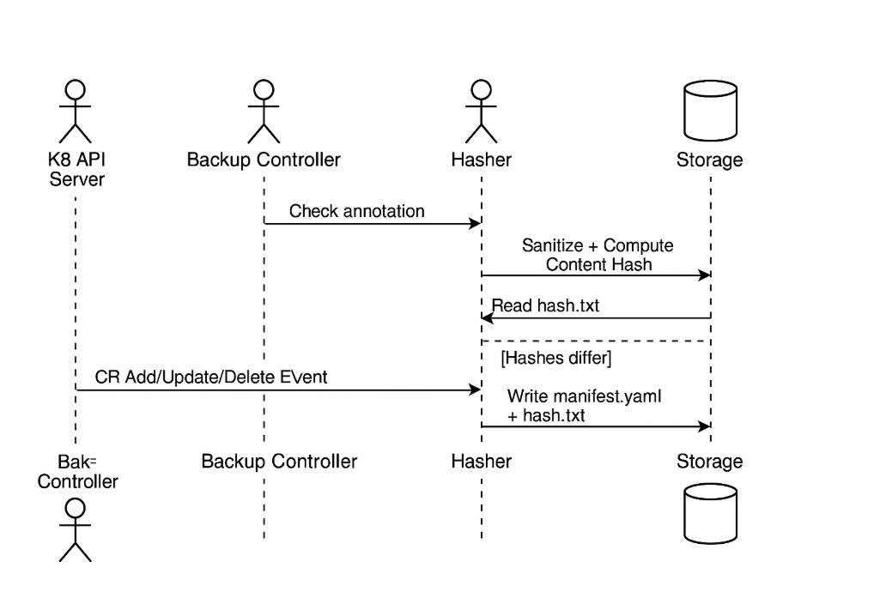

# Bastion

## Project Overview

**Bastion** is an event-driven, hash-based backup system designed for Kubernetes Custom Resources (CRs). It ensures zero-loss backups by detecting and storing only meaningful changes in CRs. Bastion is lightweight, scalable, and optimized for large-scale, multi-tenant Kubernetes clusters.

---

## Problem Statement

Traditional snapshot-based backup tools treat Kubernetes CRs as static blobs, leading to inefficiencies:

- High disk I/O and memory usage
- Poor change granularity
- Delayed recovery
- Difficulty in auditing and debugging

Bastion addresses these issues by introducing an intelligent, event-driven backup mechanism that reacts to actual changes in CRs.

---

## Key Features

- **Event-Driven Backup Engine**: Listens to Add/Update/Delete events on CRs.
- **Content Hashing**: Uses SHA-256 hashes to detect changes in sanitized CRs.
- **Dynamic Scaling**: Supports multiple CRDs and GVKs with independent worker pools.
- **Memory Efficiency**: Employs in-memory caching and batch processing.
- **Minimal Disk I/O**: Writes only when CR content changes.
- **Cross-Cluster Support**: Scales across multiple Kubernetes clusters.

---

## System Design

### Event-Driven Architecture

- Listens to CR events via informers.
- Filters events using annotations (e.g., `backup/enabled: true`).
- Sanitizes CRs and computes content hashes.
- Compares new hash with stored hash to decide on backup.
- Deletes backups for removed CRs.

### Hash-Based Change Detection

- Stores backups in: `/group/version/kind/namespace/manifest.yaml` and `hash.txt`
- On each event:
    - Sanitize CR
    - Compute hash
    - Compare with stored hash
    - Write new files if changed

---

## Sequence Diagram

### Sequence of Actions

1. K8s API Server → Backup Controller: CR event
2. Controller checks annotation
3. Controller sanitizes and hashes CR
4. Reads existing hash
5. Compares hashes
6. If changed → writes new manifest and hash

---

## State Machine

| From     | Event / Condition                          | To      |
|----------|--------------------------------------------|---------|
| Idle     | CR Add/Update/Delete with backup enabled   | Hashed  |
| Hashed   | CR Deleted                                 | Backup  |
| Hashed   | CR hash unchanged                          | Idle    |
| Hashed   | CR hash changed                            | Changed |
| Changed  | Files written                              | Backup  |
| Backup   | Cleanup complete                           | Idle    |

---

## Memory Efficiency

- **Limited Hash Cache**: LRU eviction for old hashes.
- **Batch Processing**: Buffers events and writes in batches.
- **Garbage Collection**: Deletes memory and disk data for removed CRs.

---

## Scaling Considerations

- **Dynamic Controller Setup**: One controller per GVK.
- **GVK-Scoped Informers**: Independent informers and queues.
- **Worker Pool Management**:
    - Each GVK has its own worker pool.
    - Automatically scales based on load.

### Buffered Event Handling

- Buffers events during spikes.
- Deduplicates and batches writes.
- Reduces I/O and improves throughput.

---

## Comparison with Velero

| Feature                  | Velero         | Bastion                      |
|--------------------------|----------------|------------------------------|
| Event-Driven             | No             | Yes                          |
| Granular Backup          | No             | Yes (per-CR)                 |
| Memory Usage             | High           | Low                          |
| Disk I/O                 | High           | Minimal                      |
| Customization            | Medium         | High                         |
| Scaling                  | Limited        | GVK-scoped workers           |
| Backup Speed             | Slower         | Near-instant for changed CRs |
| Backup Retention         | Manual/Scheduled | Automatic per event        |

---

## Quantitative Analysis

Assumptions:
- N = 100,000 CRs
- C = 100 changed CRs/day
- T = 5ms per CR

### Velero-style Backup

- Time: 100,000 × 5ms = 8.3 minutes
- Disk I/O: 100,000 writes

### Bastion

- Time: 100 × 5ms = 0.5 seconds
- Disk I/O: 100 writes

**~99% savings in time and disk I/O**

---

## Future Enhancements

- **BackupPolicy CRD**: Define schedules and retention.
- **Retention Management**: Keep last N backups.
- **Cross-Cluster Support**: Multi-cluster backup.
- **Backup Versioning**: Track full and incremental versions.

---

## Conclusion

Bastion offers a modern, efficient, and scalable approach to backing up Kubernetes Custom Resources. By leveraging event-driven architecture and content-aware hashing, it ensures high-fidelity backups with minimal resource usage—making it ideal for cloud-native environments.
